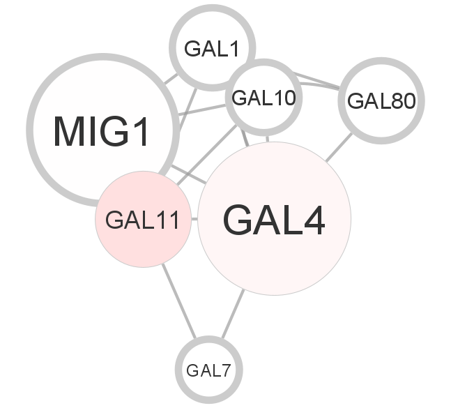
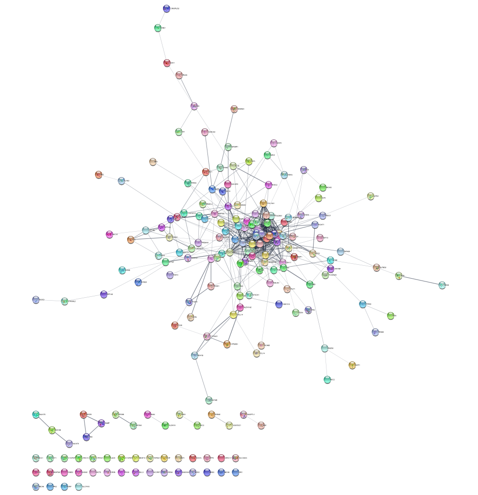
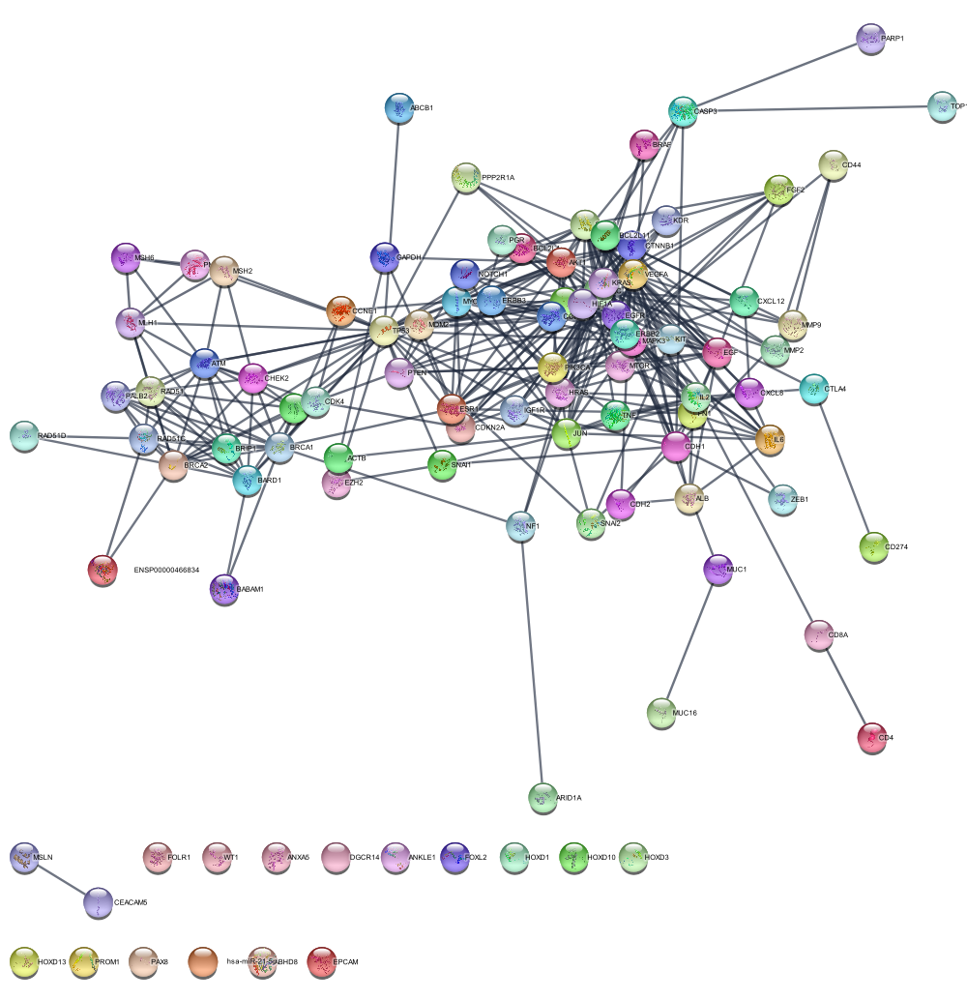
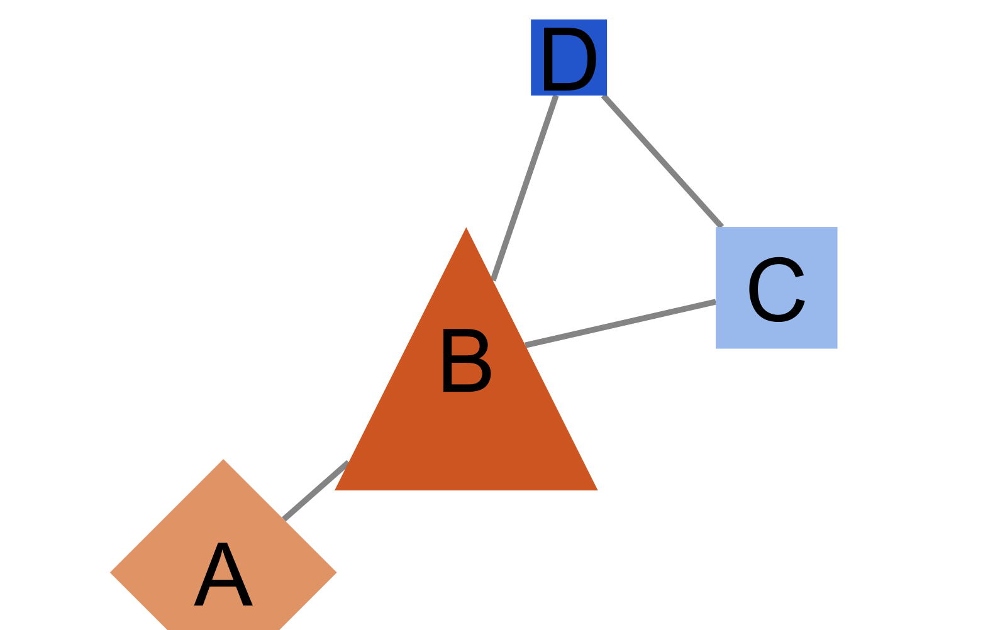

```{r setup, include=FALSE}
knitr::opts_chunk$set(echo = TRUE)
```

```{r}
BiocManager::install("RCy3")
library(RCy3)
cytoscapePing()
browseVignettes("RCy3")
```









I kept having problems when trying to knit the code despite everything working fine within Cytoscape, so I just posted the png. I promise that this work is my own and I followed the instructions exactly. After a couple hours of troubleshooting, I decided to stop trying to knit the code and just knit the output.

Thanks,

James
